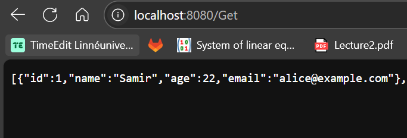

För att köra koden först behövs det ladda ner MySQL workbench, och behöver importera paketet från github
för att tillåta koppling med databasen. 
genom " go run . " kommand kommer alla filler köras och main som i sin tur kör initdb.
och skapar tabblen. koden körs på localhost 8080.
genom att klistra in "1" kommer en ny student med namn samir, med ålder 20, och email Samir@gmail.com

1) http://localhost:8080/Put?name=Samir&age=20&email=Samir@gmial.com

för att se resultaten använd "2", Detta vissar alla studenter eller "3" för att vissa student med specifik id. 

2) http://localhost:8080/Get

3) http://localhost:8080/Get-Student?name=Samir

För att tabort använd "4"
4) http://localhost:8080/Delete?id=12

sist är att updatera en existerande värde använd "5"

5) http://localhost:8080/updateName?name=Samir&newName=Sam
